# 3.Gitbash 설치

1. Git SCM 접속하기
    - Git SCM 사이트 (https://git-scm.com/)

2. Git Download
    - 오른쪽 하단에 Download ... for Windows 라고 적힌걸 클릭

  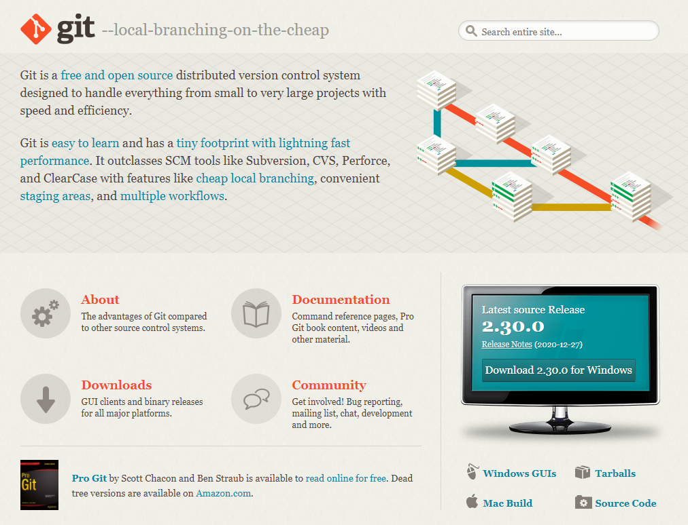

3. 다운로드 중
    - 다운로드가 정상적으로 진행되는지 파악하기

  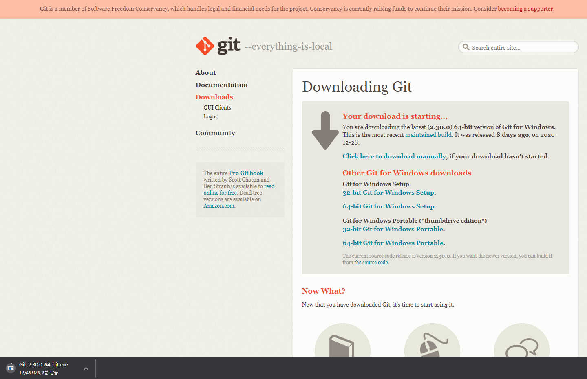

4. 다운로드 파일을 실행
    - 이 화면이 정상적으로 나오면 Next를 눌러서 진행

  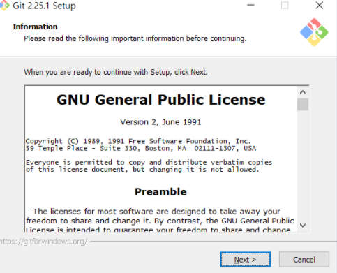

5. Git이 설치될 경로 지정
    - 이 화면이 정상적으로 나오면 Next를 눌러서 진행

  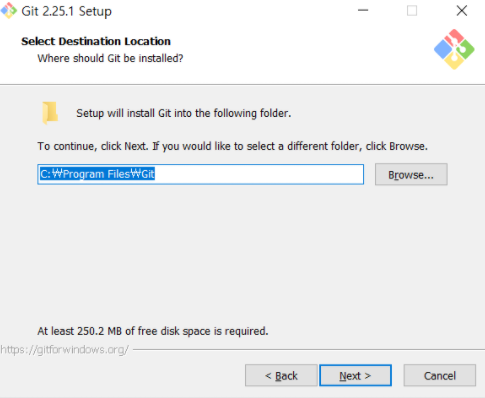

6. 설치할 구성요소 선택
    - 이 화면이 정상적으로 나오면 Next를 눌러서 진행

  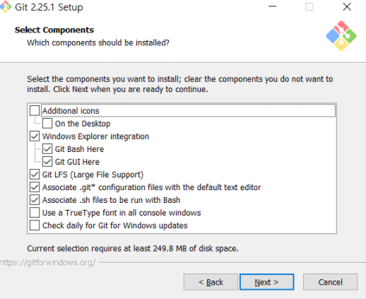

7. 시작폴더 경로를 선택
    - 이 화면이 정상적으로 나오면 Next를 눌러서 진행

  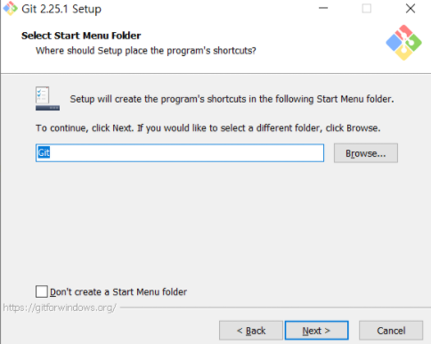

8. Git을 사용할 기본 에디터 선택
    - 이 화면이 정상적으로 나오면 Next를 눌러서 진행

  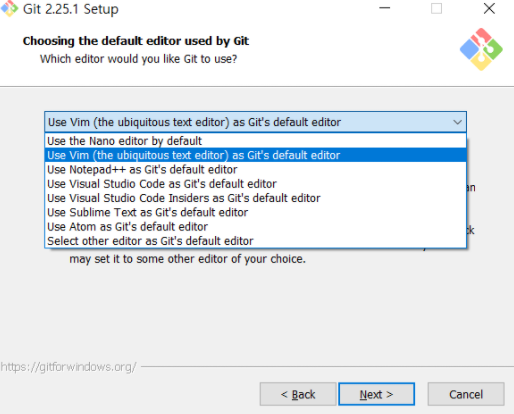

9. 환경변수 옵션 설정
    - 이 화면이 정상적으로 나오면 Next를 눌러서 진행

  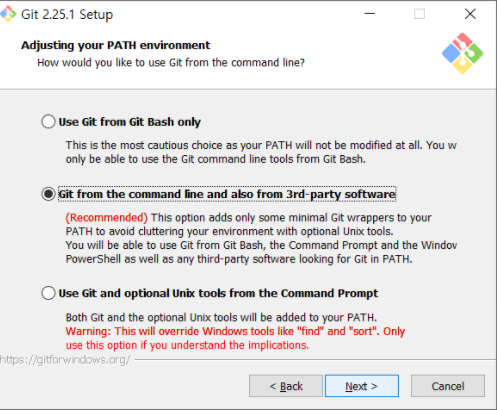

10. https 전송시 인증서 선택
    - 이 화면이 정상적으로 나오면 Next를 눌러서 진행

  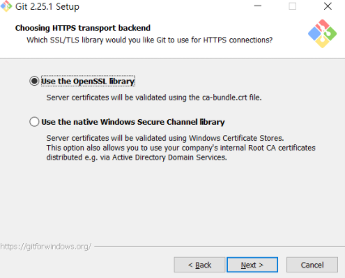

11. Git 저장소에 체크인, 체크 아웃 할 때 줄 바꿈 옵션 선택
    - 이 화면이 정상적으로 나오면 Next를 눌러서 진행

  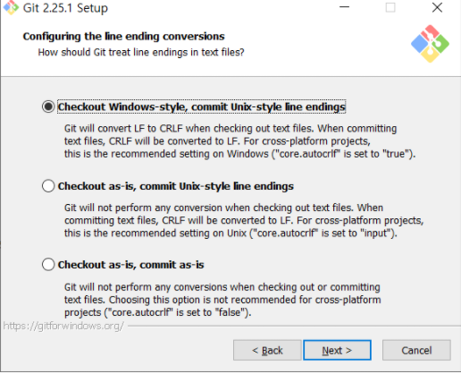

12. Git Bash 터미널 에뮬레이터의 설정
    - 이 화면이 정상적으로 나오면 Next를 눌러서 진행

  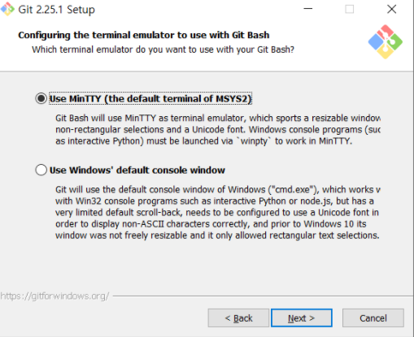

13. 기타옵션
    - 이 화면이 정상적으로 나오면 Install를 눌러서 진행

  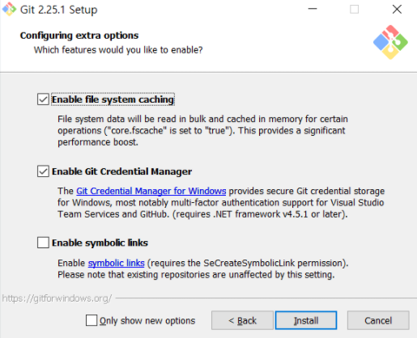

14. 설치완료
    - 이 화면이 정상적으로 나오면 Next를 눌러서 진행

  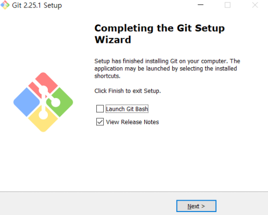

