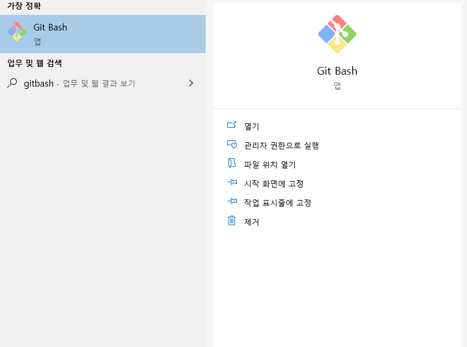
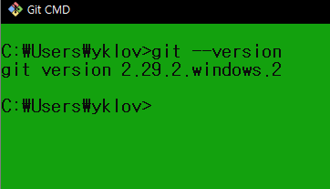
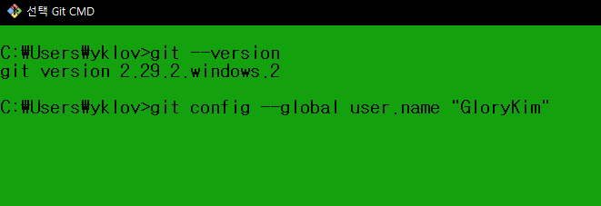
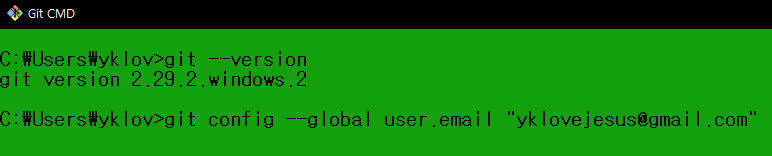
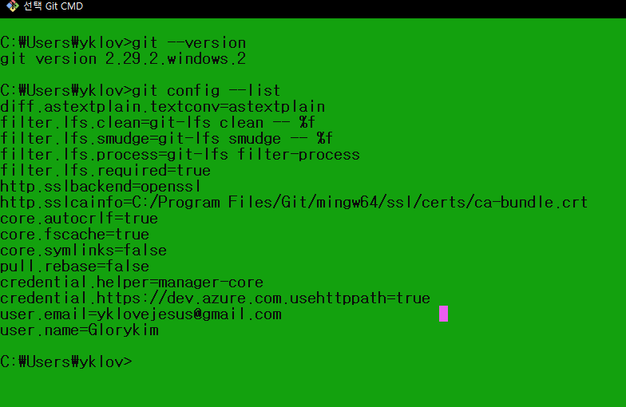

# 04.Gitbash 실행 및 계정 등록

1. 검색창에 GitBash 작성
    - 화면에 나오는 아이콘 클릭
<p align="center">
  
</p>

2. Git 버전 확인하기
```
git --version
```
<p align="center">
  
</p>

3. Git 계정 등록을 위한 본인 User.Name 작성
```
git config --global user.name "ykykykyk"
```
<p align="center">
  
</p>

4. Git 계정 등록을 위한 본인 user.email 작성
```
git config --global user.email "ykykykyk@gmail.com"
```
<p align="center">
  
</p>

5. Git 상태를 확인하기 위한 작업
```
git config --lsit
```
<p align="center">
  
</p>