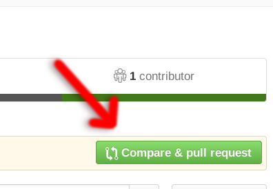
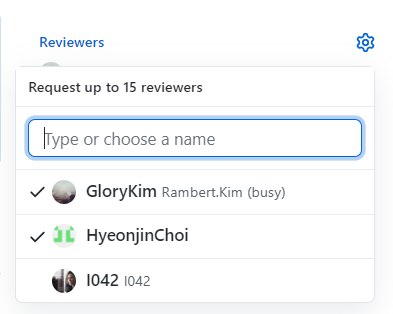
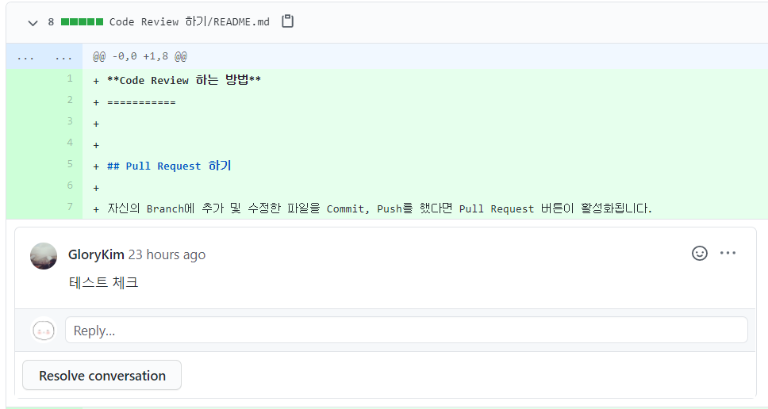
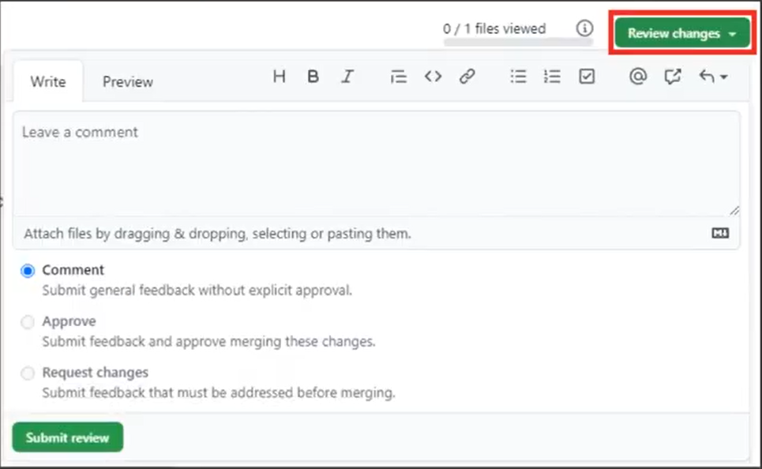
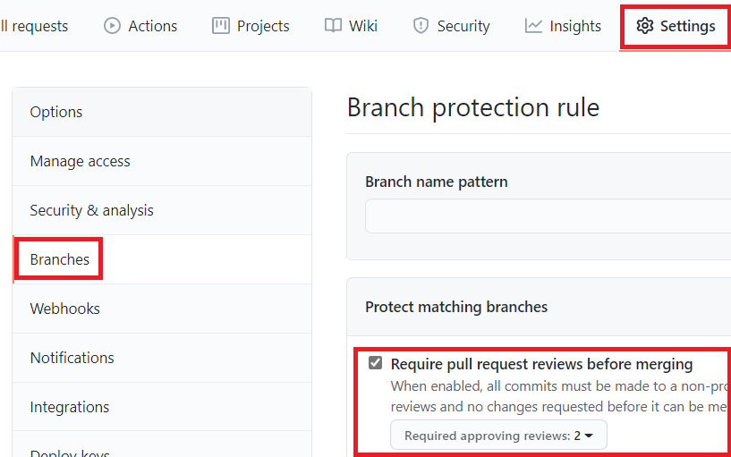

**Code Review 하는 방법**
===========

자신의 Branch에 추가 및 수정한 파일을 Commit, Push 했다면 Pull Request 버튼이 활성화됩니다.  
 

</img>  
Pull Request를 해서 병합하기 전에 리뷰어들에게 코드리뷰를 요청할 수 있습니다.    
 

</img>  
*Pull Request -> Conversation의 우측에 있음*  
 

</img>  
코드리뷰를 요청받은 리뷰어들은 Pull Request에서 리뷰를 남길 수 있습니다.  
 

</img>

### 리뷰의 3가지 방식
1. Comment : 간단한 피드백
2. Approve : 병합 승인
3. Request changes : 반드시 코드 수정을 해야 함  
 

</img>  
Settings -> Branchs -> Require pull request reviews before merging을 체크하면 최소 리뷰어 수를 충족할 때만 병합이 가능하게 바뀝니다.